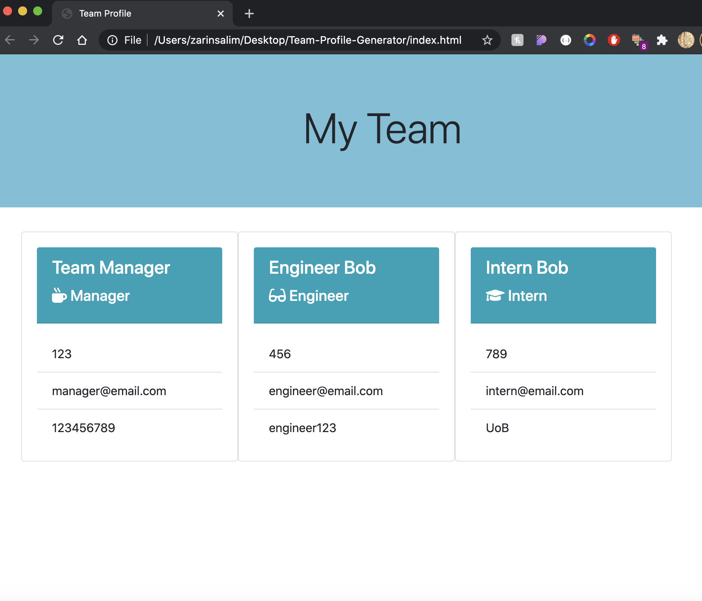

# Team Profile Generator
A Node.js command-line application that takes in information about employees on a software engineering team, then generates an HTML webpage that displays summaries for each person.

## Pseudo Code
1. Install inquirer and jest
2. Create user prompts
3. Write functions to get data for each different role
4. Write functions to display this data within cards in HTML
5. Create tests to make sure my classes work

Based on this my code would have to:
- Run as a command line application
- Generate a HTML file containing multiple cards, each displaying different information based on user input

## Difficulties
My main difficulty was making sure the syntax for the tests was correct and also getting the data from each input to display correctly. 

## Overall thoughts
This assignment was quite diffuclt but I'm glad that I finished it. If I had more time I would have liked to work more on the CSS and make the generated page look nicer, and also add validators.

## Video Demo
You can view a walkthrough of the application [here](https://drive.google.com/file/d/1Bzuh6MlHlc1LFrRLvOdC_YX-yPQMKSFK/view?usp=sharing)

